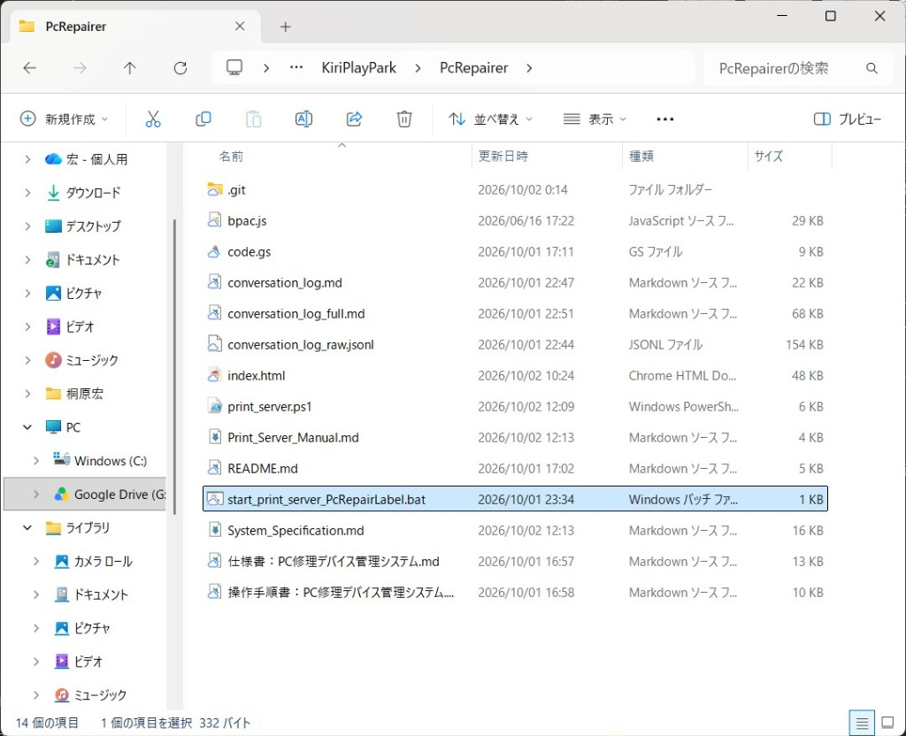
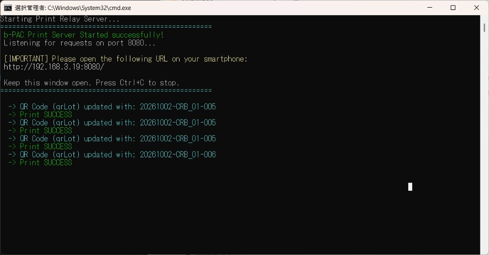
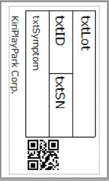

# 仕様書：PC修理デバイス管理システム (PC Repairer - Device Manager)

本書は、久喜市・加須市をはじめとする自治体および教育現場・企業から回収されたPC端末の受入・修理・検品業務において、スマートフォンのカメラや写真読取・手入力を用いて端末識別情報を素早く登録し、スプレッドシートへの一括記録およびBrother製ラベルプリンターへの印刷を連携して行う「PC Repairer - Device Manager」システムの機能設計・アーキテクチャ・データ仕様をまとめた仕様書です。

---

## 1. システム概要

### 1.1 開発の目的
PC修理現場における端末の受入登録作業において、作業員の手作業による入力ミスや採番ミス、ロット管理の不整合を排除し、「QRスキャン / 写真読取 / 手入力 → 自動採番 ＆ ラベル即時印字 → スプレッドシート一括記録」を直感的かつスピーディに行える環境を提供します。

### 1.2 主な特徴
1. **顧客・サイトコードの動的連動マスター管理**:
   - スプレッドシートの「管理」シートから、稼働中の顧客（久喜市、加須市 等）および対応サイトコード（CRB_01, CRB_02 等）を自動取得してプルダウンに展開。コードの修正なしにマスター変更が即座に反映されます。
2. **高精度QRコード解析 (18桁対応)**:
   - QRコード（18桁）を検知すると、先頭8桁（S/N）と後半10桁（MO）へ瞬時に自動パース。
3. **柔軟な手入力モーダル ＆ 複合故障部位選択**:
   - QRが読めない端末でも、S/Nへの自動 `PF` 付与、自治体ごとのDevice ID自動フォーマット（久喜市: `S25-` + 5桁 / 加須市: `Kazoedu` + 4桁）、および「設定表」シートから動的取得された故障部位マスターをチェックボックスで複数選択可能。
4. **現場に最適化されたカメラシステム (`nfcQrWriter_v01` 準拠)**:
   - 安定稼働実績のある `html5-qrcode@2.3.8` を採用。
   - 動的 `qrbox` 計算（解像度クラッシュ防止）、背面/前面カメラ自動フォールバック、ワンタップ左右反転（ミラー表示）、カメラON/OFFトグル、走査線アニメーションを完備。
5. **マルチ入力フォールバック（写真読取対応）**:
   - リアルタイムカメラが制限されている環境や暗所でも、端末標準のカメラアプリで撮影してアップロード解析する「写真読取」を搭載。
6. **マルチモーダルフィードバック**:
   - 外部音声ファイル不要の Web Audio API 電子音（ピッ・ピピッ・ブー）とスマホの振動（Vibration API）により、画面を注視しなくても成否を把握可能。
7. **連番・受注番号の自動採番**:
   - **受注ロットシーケンス番号:** `YYYYMMDD-サイトコード-追番(3桁)` （例: `20261001-CRB_01-001`）
   - **受注番号:** `サイトコード-基本番号` （例: `CRB_01-1001`）
8. **排他制御（LockService）を備えた一括更新**:
   - 作業中はブラウザ側でデータを蓄積し、作業終了時にGAS経由で対象顧客スプレッドシートへ一括書き込み。複数作業者の同時更新による番号重複を防ぐ排他制御を実装。

---

## 2. システム構成（アーキテクチャ）

```mermaid
graph TD
    A[作業端末: スマホ / タブレット / PC] -->|① アプリ起動・顧客/サイト選択| B(マスター設定動的取得)
    B <-->|init / start API| C[(マスター管理スプレッドシート)]
    
    A -->|② QRスキャン / 写真読取 / 手入力| D[端末データ解析・採番]
    D -->|③ ラベル印刷コマンド| E[Brother QL-820NWB]
    D -->|画面リストへ追加 ＆ 音/振動演出| A
    
    A -->|④ 作業終了時に一括送信 (finish)| F(Google Apps Script - code.gs)
    F -->|排他ロック ＆ データ追記| G[(対象顧客スプレッドシート)]
    F -->|最終受注番号・本日ロット追番更新| C
```



### 2.1 フロントエンド（Webアプリケーション）
* **ファイル**: `index.html` (1ファイル構成)
* **UIデザイン**: ガラスモーフィズム ＆ 洗練されたダークモード（Inter / Noto Sans JP）
* **主要ライブラリ**: `html5-qrcode v2.3.8`
* **Web API**:
  * **Web Audio API**: 電子音（ビープ音）生成
  * **Vibration API**: ハプティクスフィードバック
  * **LocalStorage**: 最後に選択した顧客・サイトコードの自動記憶
* **推奨ホスティング**: GitHub Pages, Vercel, または Webサーバー (HTTPS)
  > [!NOTE]
  > Google Apps Script の Web App 画面（`script.google.com` の iframe）ではブラウザのカメラ権限が制限される仕様があるため、本 `index.html` を GitHub Pages や Vercel 等に配置し、GASをバックエンドAPIとして呼び出す構成を推奨します。

### 2.2 バックエンド（Google Apps Script - GAS）
* **ファイル**: `code.gs`
* **実行環境**: マスター管理スプレッドシートにコンテナバインドされたGAS
* **アクセス権限**: 「全員（Anyone）」でウェブアプリ公開
* **主要機能**:
  * `apiInit()` / `action: "init"`: 顧客リスト、サイトコード、故障部位マスター、プリンターIPを返却。
  * `apiStart()` / `action: "start"`: 対象顧客・サイトコードの本日の日付、最終受注番号、本日ロット追番を返却。
  * `apiFinish()` / `action: "finish"`: `LockService` による10秒排他ロック下で、対象顧客スプレッドシートへ全レコードを一括追記し、「管理」シートの追番を上書き更新。

---

## 3. スプレッドシート・データ設計

本システムは、すべてのルーティングやマスター設定を集中管理する「マスター管理スプレッドシート」と、実際の修理明細データが蓄積される「顧客別データシート」の2層構造で設計されています。

### 3.1 マスター管理スプレッドシート（ID: `1nRrNfpDFNNoTeieRHUBCUrnOzlgXmvObA-atewPhi4o`）

#### (1) 「管理」シート
各顧客・サイトコードごとの書き込み先スプレッドシートIDと、最終採番カウンターを管理します。

| 列 | 列名 | データ型 | 例 | 役割 |
| :---: | :--- | :--- | :--- | :--- |
| **A** | 顧客 | 文字列 | `久喜市` | 顧客選択プルダウンの選択肢 |
| **B** | サイトコード | 文字列 | `CRB_01` | サイトコード選択肢（顧客に連動） |
| **C** | 対象スプレッドシートID | 文字列 | `1NK16a3wgkn...` | データ追記先スプレッドシートのID |
| **D** | 最終受注番号 | 数値 | `1000` | 累計受注番号の最終値（作業完了時に更新） |
| **E** | 最終作業日 | 文字列/日付 | `2026/10/01` | 前回作業日（本日の日付と異なる場合はロット追番を1にリセット） |
| **F** | 最終ロット追番 | 数値 | `0` | 本日のロット追番の最終値（日毎にリセット） |
| **G** | 対象スプレッドシートURL | 文字列 | `https://docs.google.com/...` | 管理者確認用のURLリンク |

#### (2) 「設定表」シート
プルダウンやチェックボックスのマスター選択肢およびシステム共通パラメータを管理します。

| 列 | 列名 | 例 | 役割 |
| :---: | :--- | :--- | :--- |
| **A** | 故障部位マスター | `01_LCD破損`<br>`02_LDCはずれ`<br>`03_タッチスクリーン不良`<br>`04_LCD色調異常`<br>`...` | 手入力モーダル内のチェックボックス選択肢としてアプリへ動的配信 |
| **B〜D** | 分類・備考 | 任意 | スプレッドシート側の集計・分類用列 |

※ `PRINTER_IP` というキーワードを行内に記載することで、デフォルトプリンターIPアドレス（例: `192.168.11.50`）も動的に設定可能。

---

### 3.2 顧客別スプレッドシート（データ記録・明細出力用）
作業終了時にGASから送られてきた受入・修理登録データが1行ずつ自動追記されます。

| 列 | 列名 | データ型 | 例 | 登録ルール |
| :---: | :--- | :--- | :--- | :--- |
| **A** | Timestamp | 日時文字列 | `2026/10/01 15:05:27` | 端末側での登録日時 (JST) |
| **B** | 受注ロットシーケンス番号 | 文字列 | `20261001-CRB_01-001` | `YYYYMMDD-サイトコード-追番(3桁)` |
| **C** | 受注番号 | 文字列 | `CRB_01-1001` | `サイトコード-累計番号` |
| **D** | QR Data | 文字列 | `123456789012345678` | QRコード生データ（18桁 / 手入力時は空欄） |
| **E** | S/N | 文字列 | `PF12345` | QR先頭8桁、または手入力時（先頭に自動PF付与） |
| **F** | MO | 文字列 | `9012345678` | QR後半10桁（手入力時は空欄） |
| **G** | DeviceId | 文字列 | `S25-12345` / `Kazoedu1234` | 手入力時に登録された自治体Device ID |
| **H** | 申告症状 (故障部位) | 文字列 | `01_LCD破損, 03_タッチスクリーン不良` | 手入力時に選択された故障部位（カンマ区切り） |

---

## 4. 画面・機能仕様詳細

### 4.1 画面1: 初期設定・作業開始画面
* **顧客選択**: スプレッドシートから読み込まれた顧客一覧を展開。
* **サイトコード選択**: 選択された顧客に紐づくサイトコードのみを自動フィルタリングして表示。
* **LocalStorage連携**: 前回選択した顧客・サイトコードを自動復元。
* **作業開始ボタン**: GASの `start` API を呼び出し、最新の連番と設定を取得してカメラ画面へ遷移。

### 4.2 画面2: QR読み取り・作業画面
* **カメラコントロールバー**:
  * `[ ⇄ ]` **ミラー切替**: 映像の左右反転をトグル。
  * `[ 📹 ]` **カメラON/OFF**: カメラの一時停止・再起動。
  * `[ 🔄 ]` **カメラ切替**: 複数カメラ（内/外）の切り替え。
* **QRコード読み取り**:
  * 18桁QRコードを検知すると「ピッ」と電子音が鳴り、S/NとMOにパースして即座に採番・リスト追加。
* **「📷 写真読取」ボタン**:
  * 端末のカメラアプリを起動して写真撮影し、画像内のQRコードを高精度に解析。
* **「⌨️ 手入力」ボタン**:
  * 手入力モーダルをポップアップ表示。
* **処理済みリスト**:
  * 登録された端末が上から順にカード形式でリアルタイム表示される（手入力/スキャンのバッジ付き）。
* **「すべての更新を終えて終了」ボタン**:
  * 蓄積されたレコード配列をGASへPOST送信し、スプレッドシートを更新後、安全に初期化。

### 4.3 手入力モーダル仕様
* **S/N**: 入力値の先頭に自動で **`PF`** を付与。アルファベットは自動で大文字化。
* **Device ID**: 選択中の顧客に応じてルールとプレフィックスを自動切り替え。
  * **久喜市:** プレフィックス `S25-` ＋ 5桁数値入力（例: `S25-12345`）
  * **加須市:** プレフィックス `Kazoedu` ＋ 4桁数値入力（例: `Kazoedu1234`）
* **故障部位**: 「設定表」シートのマスターから生成されたチェックボックスから複数選択可能。

---

## 5. プリンター連携仕様 (Brother QL-820NWB)

端末の登録（スキャンまたは手入力）が完了した瞬間に、JavaScript 内の `printLabel(record)` 関数が呼び出され、印刷コマンドが送信されます。

* **接続方式**: 印刷中継サーバー（Print Relay Server）経由でのローカルネットワーク通信
* **中継サーバー**: `print_server.ps1` (PowerShellスクリプト。ポート8080で待ち受け)
* **ラベルテンプレート**: `PcRepairLabel.lbx` (P-touch Editor テンプレート)
* **印字項目**:
  1. 受注ロットシーケンス番号（qrLot バーコード および txtLot テキスト）
  2. 受注番号 (txtSN に割当)
  3. S/N (txtSN)
  4. Device ID (txtID)
  5. 故障部位 (txtSymptom)
* **通信実装方式**:
  * スマホブラウザからローカルのWindows PC（中継サーバー）へ HTTP POST で JSON を送信。
  * `print_server.ps1` が Brother b-PAC SDK (COMオブジェクト `bpac.Document`) を利用してテンプレートへデータを流し込み、印刷を実行します。






---

## 6. 免責事項・ライセンス

* **免責事項**: 本システムによるデータ記録やラベル印字に伴い発生した端末の誤登録、データ損失、機器トラブルについて、製作者は一切の責任を負いません。本番運用前に必ず現場での動作検証を実施してください。
* **ライセンス**: 本プロジェクトの著作権は KiriPlayPark に帰属します。
